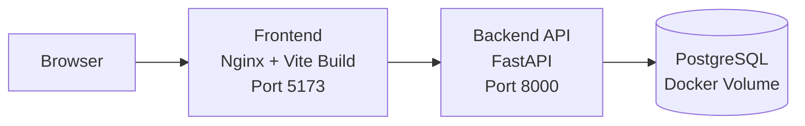

# Cloud- und Architekturkonzept - MaintCloud AI

## Ziel

Dieses Dokument beschreibt die aktuelle technische Architektur von MaintCloud AI sowie einen realistischen naechsten Schritt in Richtung Cloud- oder Demo-Betrieb.

## Aktueller Ist-Stand

MaintCloud AI besteht derzeit aus zwei klar getrennten Anwendungsteilen:

- Frontend: React mit Vite
- Backend: FastAPI mit SQLAlchemy

Die Datenhaltung ist fuer den eigentlichen Anwendungsbetrieb jetzt auf PostgreSQL ausgerichtet. Fuer Tests bleibt SQLite weiterhin erlaubt, weil die bestehende Testsuite darauf schnell und stabil laeuft.

## Aktuelle Komponenten

### Frontend

- laeuft lokal auf Port `5173`
- zeigt Maschinenuebersicht und Zustandsdaten an
- greift per REST auf das Backend zu
- kann lokal per `npm run dev` entwickelt werden
- wird im Standard-Docker-Stack als gebautes Frontend ueber Nginx ausgeliefert

### Backend

- laeuft lokal auf Port `8000`
- stellt REST-Endpunkte fuer Maschinen, Sensordaten, Wartung und Vorhersagelogik bereit
- bietet Swagger UI unter `/docs`
- kann per `uvicorn` oder Docker gestartet werden

### Datenbank

- Ziel-Datenbank fuer Betrieb und Deployment ist PostgreSQL
- im Docker-Betrieb ueber ein persistentes Volume gespeichert
- SQLite bleibt nur fuer lokale Tests und einfache Entwicklungsfaelle erhalten

## Datenfluss

1. Das Frontend sendet HTTP-Anfragen an das Backend.
2. Das Backend validiert die Anfragen und fuehrt die Geschaeftslogik aus.
3. Das Backend liest oder schreibt Daten in die PostgreSQL-Datenbank.
4. Das Frontend stellt die Antworten als Maschinenstatus, Sensorwerte und Wartungsinformationen dar.

## Lokale Zielarchitektur mit Docker

```text
Browser
  |
  v
Frontend Container (Nginx mit Vite-Build, Port 5173)
  |
  v
Backend Container (FastAPI, Port 8000)
  |
  v
PostgreSQL-Datenbank im Docker-Volume
```

## Architekturdiagramm fuer Praesentation



## Warum diese Architektur fuer den MVP sinnvoll ist

- einfache lokale Inbetriebnahme
- klare Trennung zwischen Frontend und Backend
- reproduzierbare Entwicklungsumgebung ueber Docker Compose
- gute Grundlage fuer Praesentationen und technische Erklaerung

## Grenzen des aktuellen MVP-Setups

- es gibt noch kein zentrales Monitoring, Logging oder Authentifizierungskonzept
- Cloud-Betrieb ist vorbereitet, aber noch nicht vollstaendig umgesetzt

## Empfohlenes naechstes Deployment-Ziel

Fuer den naechsten Ausbauschritt ist ein einfaches Demo-Deployment sinnvoll:

- Frontend und Backend weiterhin als getrennte Container
- Deployment per Docker Compose auf einer einzelnen VM oder einem Testserver
- PostgreSQL als zentrale Betriebsdatenbank verwenden
- Frontend bereits als Build ueber einen Webserver ausliefern
- spaeter Reverse Proxy und HTTPS ergaenzen

Das ist einfacher und realistischer als sofort ein komplexes Cloud-Setup mit vielen Managed Services einzufuehren.

## Zielbild Demo-Deployment auf einem Server

```text
Internet oder lokales Netzwerk
  |
  v
Server oder VM mit Docker Compose
  |
  +-- Frontend-Container
  |
  +-- Backend-Container
  |
  `-- Persistentes Daten-Volume fuer PostgreSQL
```

## Zielbild fuer spaetere Cloud-Variante

```text
Browser
  |
  v
Frontend Hosting / Static Hosting
  |
  v
Backend API Container / App Service
  |
  v
Managed Database (PostgreSQL)
```

Optionale spaetere Ergaenzungen:

- Reverse Proxy
- TLS / HTTPS
- Benutzerverwaltung
- Monitoring und zentrales Logging
- CI/CD fuer automatisches Deployment

## Betriebs- und Sicherheitsaspekte

Fuer einen spaeteren produktiven Betrieb sollten mindestens folgende Punkte ergaenzt werden:

- Trennung von Entwicklungs- und Produktivkonfiguration
- Verwaltung von Umgebungsvariablen und Secrets
- HTTPS und Reverse Proxy
- Monitoring, Logging und Backup-Konzept
- rollenbasierter Zugriff fuer Benutzer

## Kosten- und Skalierungssicht

### Aktueller Stand

- geringe Infrastrukturkosten
- einfacher Betrieb
- gut fuer Vorfuehrung und Entwicklung

### Spaeterer Ausbau

- hoehere Kosten durch Datenbank, Hosting und Monitoring
- bessere Zuverlaessigkeit und Skalierbarkeit
- professionellerer Betriebsrahmen

## Empfohlene naechste Schritte

1. Reverse Proxy und HTTPS ergaenzen
2. Dev- und Deployment-Konfiguration sauber trennen
3. Datenmigrationen fuer spaetere Schema-Aenderungen vorbereiten
4. entscheiden, ob zuerst Monitoring oder Frontend-Ausbau priorisiert wird
