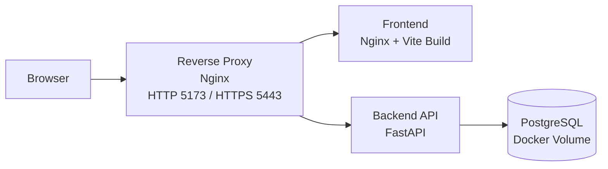

# Cloud- und Architekturkonzept - MaintCloud AI

## Ziel

Dieses Dokument beschreibt die aktuelle technische Architektur von MaintCloud AI sowie einen realistischen naechsten Schritt in Richtung Cloud- oder Demo-Betrieb.

## Aktueller Ist-Stand

MaintCloud AI besteht derzeit aus zwei klar getrennten Anwendungsteilen:

- Frontend: React mit Vite
- Backend: FastAPI mit SQLAlchemy

Die Datenhaltung ist fuer den eigentlichen Anwendungsbetrieb jetzt auf PostgreSQL ausgerichtet. Fuer Tests bleibt SQLite weiterhin erlaubt, weil die bestehende Testsuite darauf schnell und stabil laeuft.

Zusaetzlich sind bereits produktionsnaehere Betriebsbausteine vorhanden:

- Reverse Proxy mit lokalem HTTPS
- Docker-Healthchecks fuer Datenbank, Backend und Proxy
- Request Logging im Backend
- Readiness- und Liveness-Endpunkte
- automatische Datenbankmigrationen beim Start per Alembic

## Aktuelle Komponenten

### Frontend

- laeuft lokal auf Port `5173`
- zeigt Maschinenuebersicht und Zustandsdaten an
- greift per REST ueber den Reverse Proxy auf das Backend zu
- kann lokal per `npm run dev` entwickelt werden
- wird im Standard-Docker-Stack als gebautes Frontend ueber Nginx ausgeliefert

### Reverse Proxy

- zentraler Einstiegspunkt fuer Browser-Zugriffe
- leitet `/` an das Frontend weiter
- leitet `/api`, `/docs`, `/openapi.json` und `/health` an das Backend weiter
- stellt lokal bereits HTTPS mit selbstsigniertem Zertifikat bereit
- vereinfacht spaetere Einfuehrung echter Zertifikate
- uebernimmt einfache HTTP-zu-HTTPS-Weiterleitung

### Backend

- laeuft lokal auf Port `8000`
- stellt REST-Endpunkte fuer Maschinen, Sensordaten, Wartung und Vorhersagelogik bereit
- bietet Swagger UI unter `/docs`
- kann per `uvicorn` oder Docker gestartet werden
- fuehrt beim Start Alembic-Migrationen aus
- protokolliert Requests mit Request-ID, Statuscode und Dauer
- stellt `/health`, `/health/live` und `/health/ready` bereit

### Datenbank

- Ziel-Datenbank fuer Betrieb und Deployment ist PostgreSQL
- im Docker-Betrieb ueber ein persistentes Volume gespeichert
- SQLite bleibt nur fuer lokale Tests und einfache Entwicklungsfaelle erhalten
- Schema-Aenderungen werden ueber Alembic versioniert

## Datenfluss

1. Der Browser ruft den Reverse Proxy auf.
2. Der Reverse Proxy liefert das Frontend aus oder leitet API-Anfragen an das Backend weiter.
3. Das Backend validiert die Anfragen und fuehrt die Geschaeftslogik aus.
4. Das Backend liest oder schreibt Daten in die PostgreSQL-Datenbank.
5. Das Frontend stellt die Antworten als Maschinenstatus, Sensorwerte und Wartungsinformationen dar.

## Lokale Zielarchitektur mit Docker

```text
Browser
  |
  v
Reverse Proxy (HTTP 5173 / HTTPS 5443)
  |
  +--> Frontend Container (Nginx mit Vite-Build)
  |
  `--> Backend Container (FastAPI)
           |
           v
      PostgreSQL-Datenbank im Docker-Volume
```

## Architekturdiagramm fuer Praesentation



## Warum diese Architektur fuer den MVP sinnvoll ist

- einfache lokale Inbetriebnahme
- klare Trennung zwischen Frontend und Backend
- reproduzierbare Entwicklungsumgebung ueber Docker Compose
- produktionsnaehere Datenbankbasis durch PostgreSQL
- Betriebsfaehigkeit durch Healthchecks und Logging frueh vorbereitet
- gute Grundlage fuer Praesentationen und technische Erklaerung

## Grenzen des aktuellen MVP-Setups

- es gibt noch keine Authentifizierung oder Benutzerrollen
- Logging ist vorhanden, aber noch ohne zentrale Aggregation oder Alarmierung
- lokal wird noch ein selbstsigniertes Zertifikat statt eines vertrauenswuerdigen Zertifikats genutzt
- Cloud-Betrieb ist vorbereitet, aber noch nicht als echtes Zielsystem automatisiert umgesetzt

## Empfohlenes naechstes Deployment-Ziel

Fuer den naechsten Ausbauschritt ist ein einfaches Demo-Deployment sinnvoll:

- Frontend und Backend weiterhin als getrennte Container
- Reverse Proxy als zentralen Einstiegspunkt verwenden
- Deployment per Docker Compose auf einer einzelnen VM oder einem Testserver
- PostgreSQL als zentrale Betriebsdatenbank verwenden
- Frontend bereits als Build ueber einen Webserver ausliefern
- spaeter echte Zertifikate fuer Domain und Produktivbetrieb einbinden

Das ist einfacher und realistischer als sofort ein komplexes Cloud-Setup mit vielen Managed Services einzufuehren.

## Zielbild Demo-Deployment auf einem Server

```text
Internet oder lokales Netzwerk
  |
  v
Server oder VM mit Docker Compose
  |
  +-- Reverse-Proxy-Container
  |
  +-- Frontend-Container
  |
  +-- Backend-Container
  |
  `-- Persistentes Daten-Volume fuer PostgreSQL
```

## Zielbild fuer spaetere Cloud-Variante

```text
Browser
  |
  v
Frontend Hosting / Static Hosting
  |
  v
Backend API Container / App Service
  |
  v
Managed Database (PostgreSQL)
```

Optionale spaetere Ergaenzungen:

- Reverse Proxy
- TLS / HTTPS
- Benutzerverwaltung
- zentrales Monitoring und Logging
- CI/CD fuer automatisches Deployment

## Betriebs- und Sicherheitsaspekte

Fuer einen spaeteren produktiven Betrieb sollten mindestens folgende Punkte ergaenzt werden:

- Trennung von Entwicklungs- und Produktivkonfiguration
- Verwaltung von Umgebungsvariablen und Secrets
- vertrauenswuerdige TLS-Zertifikate statt selbstsignierter Zertifikate
- zentrales Monitoring, Log-Aggregation und Backup-Konzept
- rollenbasierter Zugriff fuer Benutzer

## Kosten- und Skalierungssicht

### Aktueller Stand

- geringe Infrastrukturkosten
- einfacher Betrieb
- gut fuer Vorfuehrung und Entwicklung

### Spaeterer Ausbau

- hoehere Kosten durch Datenbank, Hosting und Monitoring
- bessere Zuverlaessigkeit und Skalierbarkeit
- professionellerer Betriebsrahmen

## Empfohlene naechste Schritte

1. Architektur- und Deployment-Doku auf den Ist-Stand mit Healthchecks, Logging und Alembic halten
2. echte TLS-Zertifikate fuer Domain oder Testserver einbinden
3. Trennung von Entwicklungs-, Demo- und spaeterer Produktivkonfiguration schaerfen
4. Frontend-Detailansichten und Verlaufsdaten als naechste Produktfunktion priorisieren
